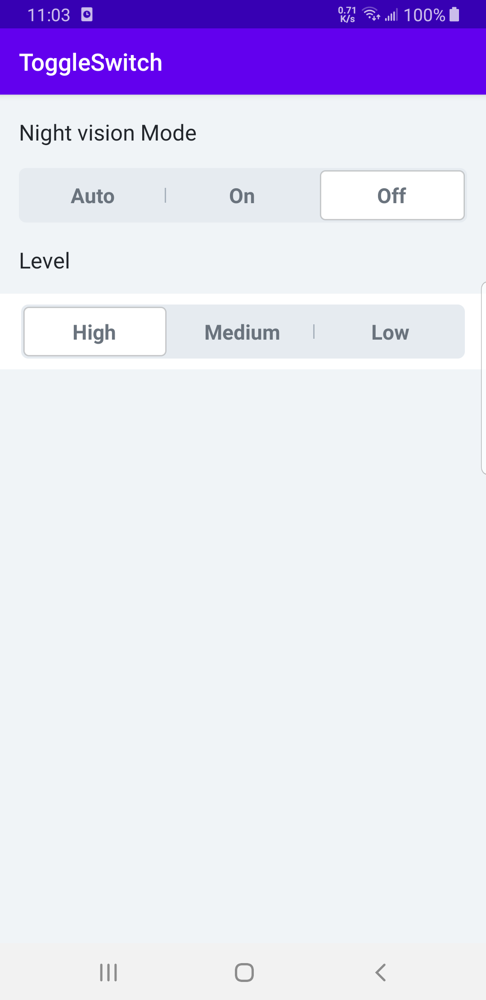

```
<com.example.switchlib.ToggleSwitch
        android:id="@+id/tsNightVisionMode"
        android:layout_width="match_parent"
        android:layout_height="46dp"
        android:layout_marginStart="16dp"
        android:layout_marginTop="18dp"
        android:layout_marginEnd="16dp"
        android:layout_marginBottom="9dp" />
        
<com.example.switchlib.ToggleSwitch
        android:id="@+id/tsLevel"
        android:layout_width="match_parent"
        android:layout_height="64dp"
        android:layout_marginTop="16dp"
        android:background="@android:color/white"
        android:paddingStart="18dp"
        android:paddingTop="9dp"
        android:paddingEnd="18dp"
        android:paddingBottom="9dp" />
```


```
val list = listOf("Auto", "On", "Off")
val list2 = listOf("High", "Medium", "Low")

tsNightVisionMode.setTitles(list)
tsNightVisionMode.setOnToggleSwitchChangeListener { position: Int ->
Log.e("log", "cur position $position")
}
tsNightVisionMode.setCheckedTogglePosition(2)

tsLevel.setTitles(list2)
tsLevel.setCheckedTogglePosition(0)
```


